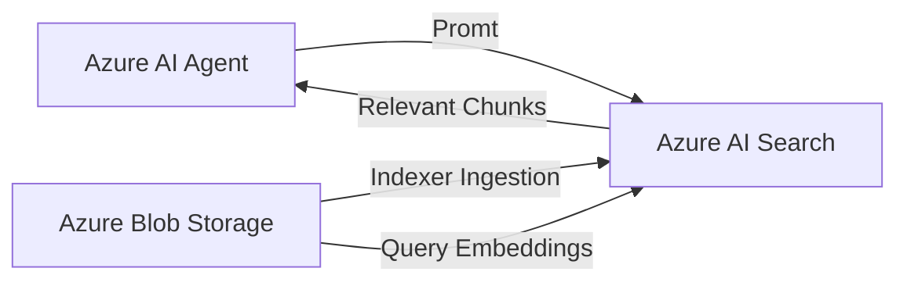

# Configure an agent in azure AI using blob storage and AI search
This solution mentions steps to create an Azure AI agent which acts as a company's point of contact for any policy related information.
The agent is based on company policy document uploaded in azure blob storage. 
Azure AI search is used for indexing the document to be available for AI agent.

**1. Document Storage**
Knowledge files are stored in Azure Blob Storage

**2. Indexing & Vectorization**
Azure AI Search indexer:
Reads documents from Blob
Chunks content
Generates embeddings
Stores them in the search index

**3. Retrieval (RAG)**
Azure AI Agent sends a query to Azure AI Search
Search returns the most relevant content

**4. Response Generation**

The agent uses retrieved context to generate a grounded answer
